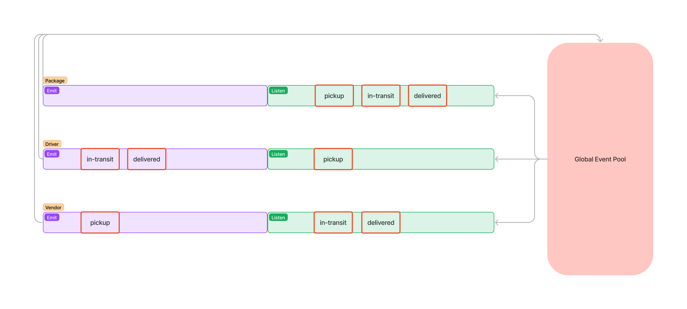

# Code Academy Parcel Service

The Code Academy Parcel Service is a workshop in 

Author: [Robert Shepley](https://github.com/shepleysound)
<!-- Replace URL's and add more necessary links -->
<!-- - [Tests Report]()
- [Assignment Pull Request]()
- [Heroku Prod Deployment]() -->

## Documentation

### Running the application locally

<!-- - Ensure PostgreSQL is setup on your machine, and that you have an existing user with createdb permissions. -->

- Clone the repository to your local machine, then run the following commands in your terminal -

  ```bash
    npm install
  ```

<!-- - Add the following lines to the newly created `.env` file.

  ```text
  PORT=<port number>
  SECRET=<AStringToBeKeptSecret>
  ``` -->

<!-- - In the `config/config.json` file, set your username and password under the 'development' entry. Keep in mind, these both must be wrapped in double quotes. -->

- Run the following command -

  ```bash
    npm start
  ```

<!-- - Congratulations! You should now be able to access the application in your browser by navigating to `http://localhost:PORT/`, with `PORT` being the port number that you specified in the .env.

- When run locally, the server currently creates a `memory` file in the project's root directory that contains data for a sqlite3 database. If you would like to clear out the database, you can simply delete this file and it will be freshly created the next time the server is started using `npm start`. -->

## Tests

- Unit Tests: `npm run test`

## Structure Diagram

